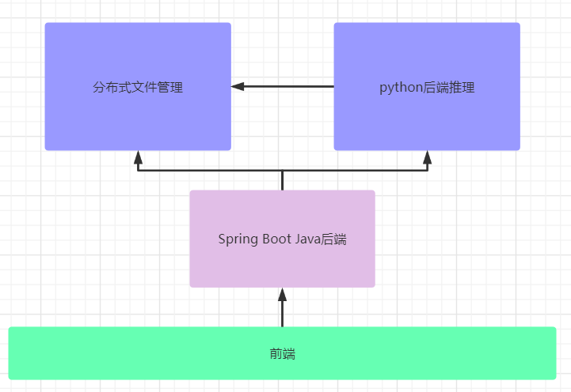

## 代码说明

### 环境配置

- python 版本：3.7
- cuda 版本：102
- PaddlePaddle版本：2.3

### 程序说明

- 系统初步架构

  

- 推理服务：使用MabbitMq消息队列得到Java服务返回的文件的具体位置，根据不同任务选择不同的推理器

### 文件说明

- back-end：后端文件
  - inference：python推理服务
  - back-end-service：springboot后端
